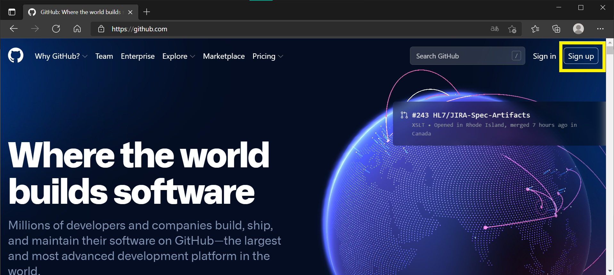
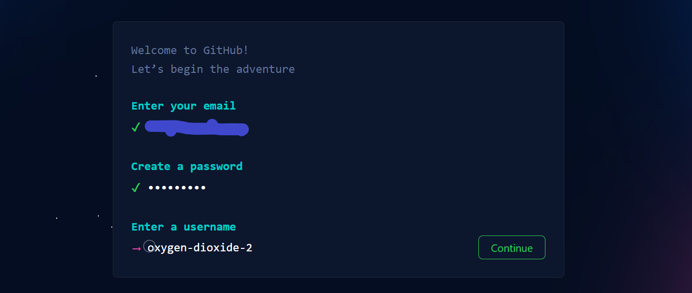
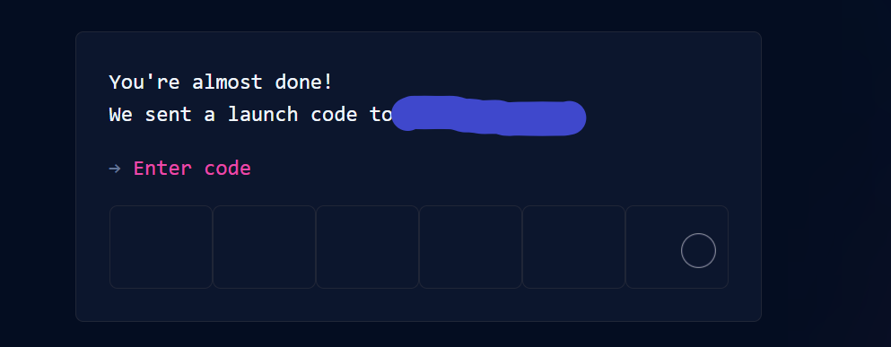
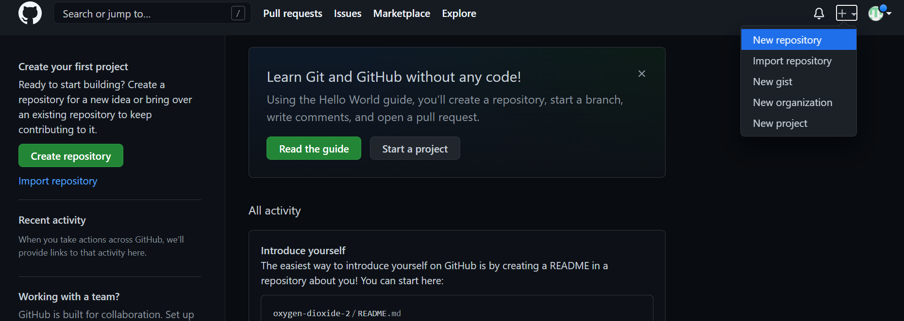
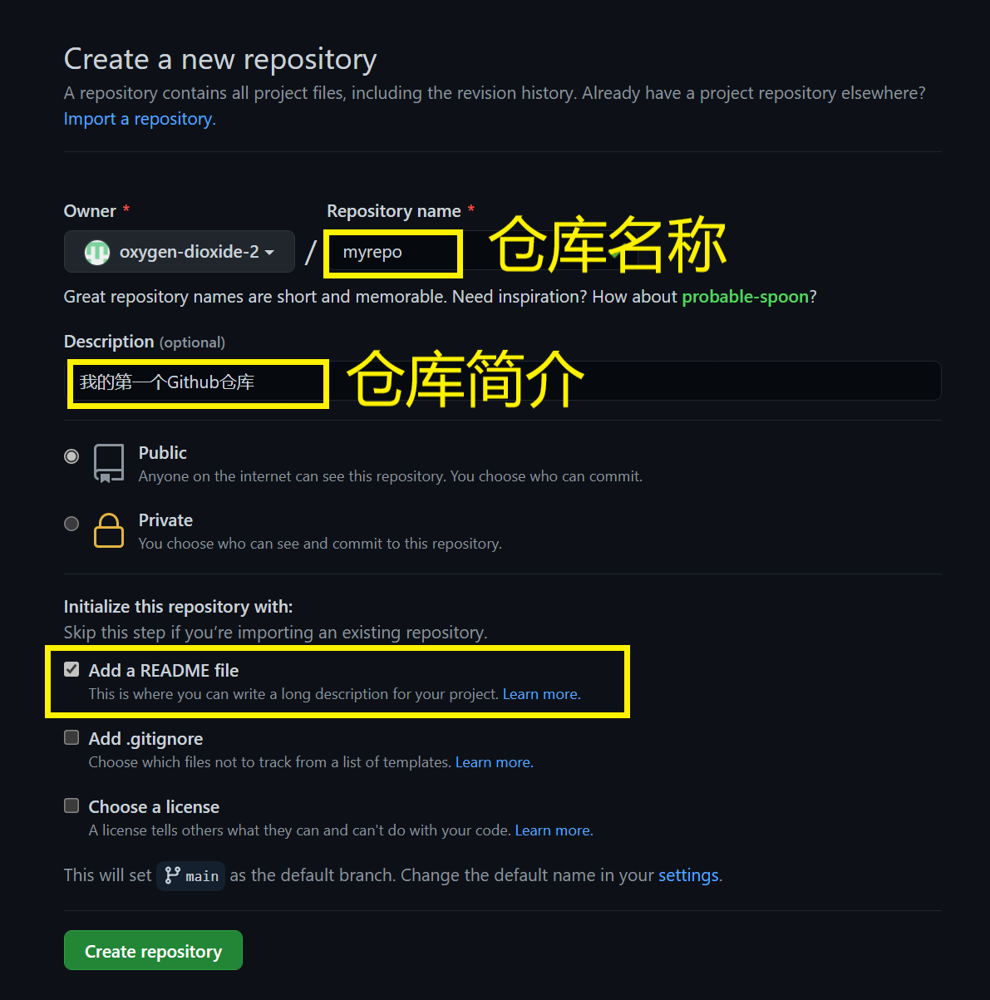
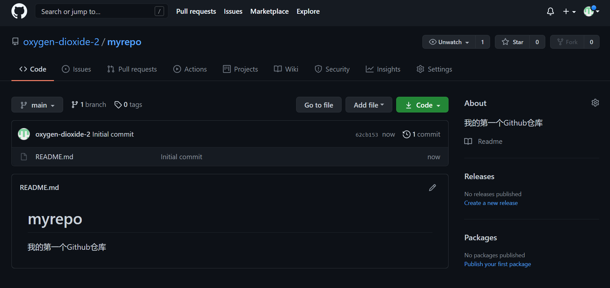
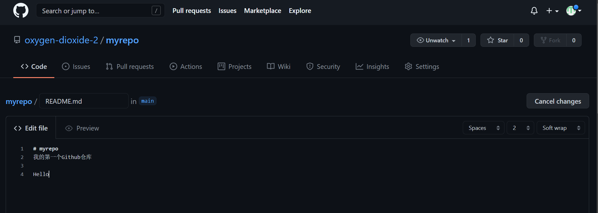
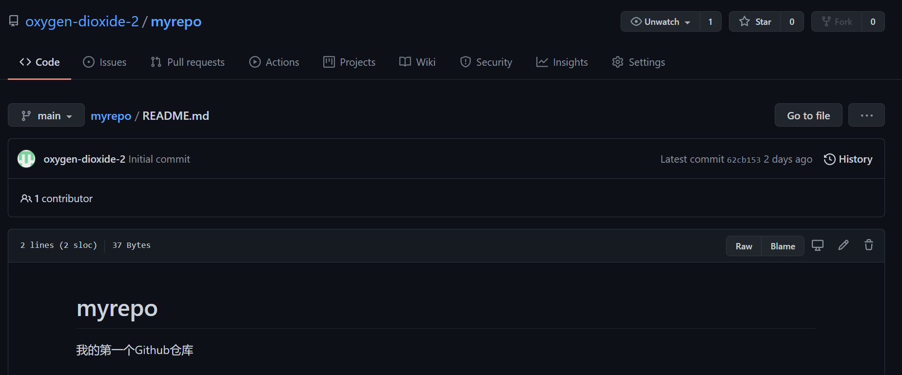

# 2. 使用仓库

## 注册账号
首先进入[Github](github.com)，点击右上角的"Sign up"

按照提示输入你的邮箱，设置密码和用户名，输入图形验证码。

然后Github会给你发送一封含有验证码的邮件，在网页上输入邮件验证码，即可完成注册。

## 使用仓库
### 创建仓库
点击右上角的加号->New repository

输入仓库名称，简介，并打开“Add a readme file”，点击“Create Repository”

### 仓库页面基本功能

创建好仓库后，里面有一个文本文件"README.md"。这个文件是仓库的“封面”，内容会自动显示在仓库主页。一般在README.md中对仓库内容进行介绍。

点击预览区右上角的铅笔图标，进入编辑页面。

编辑框中的代码叫做Markdown，是Github的富文本格式。关于Markdown格式，可参考少数派的[Markdown：怎么用，以及为什么用](https://sspai.com/post/56616)

编辑完成后，滚动到页面底部，点击“Commit Changes”，即可保存文件。

在仓库页面，我们还可以进行以下文件管理操作：
- 新建文本文件：点击Add File->Create new file
- 上传文件：将文件拖入窗口
- 打包下载：点击->Download Zip

点击文件名，进入单个文件页面

可以进行以下操作：
- 下载文件：右键点击预览区右上角的Raw，选择“将链接另存为”
- 编辑文件：点击预览区右上角的铅笔图标。
- 删除文件：点击预览区右上角的垃圾桶图标。

如果要进行更复杂的文件管理操作，就需要将仓库[同步到本地](3.md)。

[上一章 1. Github是什么](1.md)

[下一章 3. 本地同步](3.md)