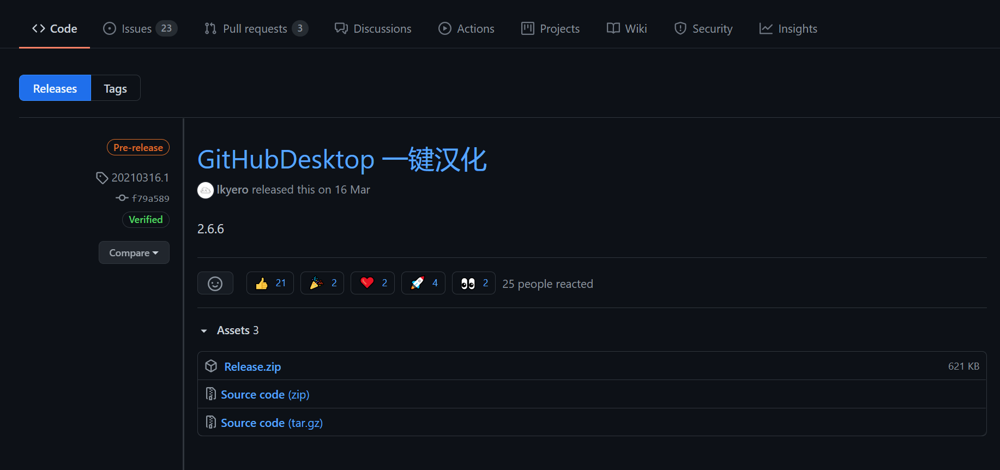
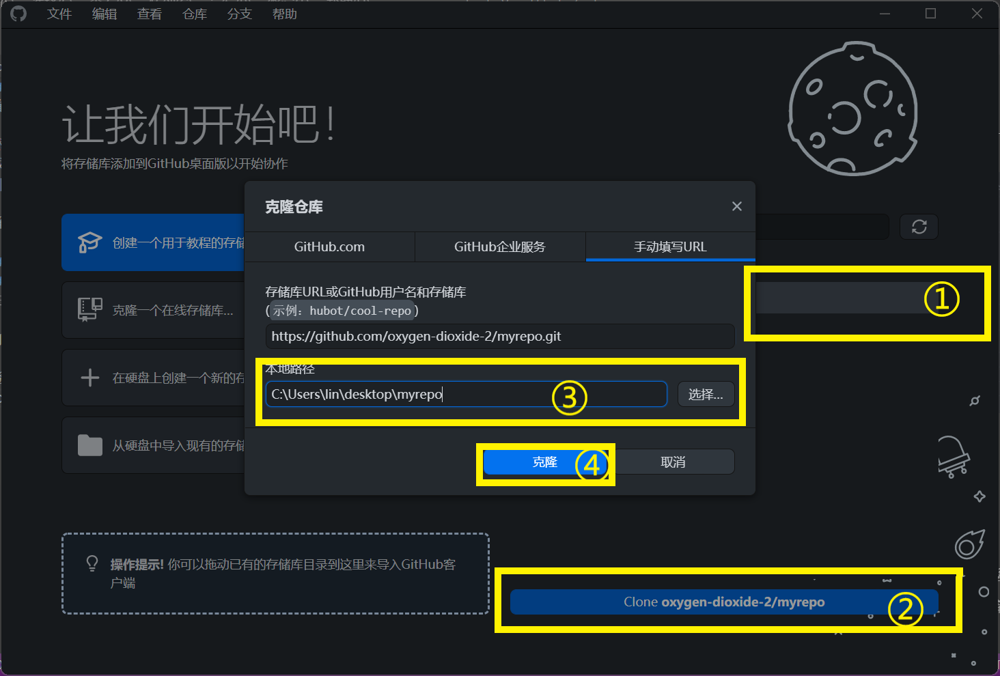

# 3. 本地同步
上一章介绍了Github仓库页面的基本使用方法。但是，如果要进行更高级的文件管理，例如创建文件夹，就需要将仓库同步到本地。

这里我们用[Github客户端](https://desktop.github.com/)来进行同步。

## Github客户端的安装、汉化
首先去[官网](https://desktop.github.com/)下载安装包并运行。

然后去 https://github.com/lkyero/GitHubDesktop_zh/releases 下载汉化补丁（Assets下面的Release.zip）。

解压，运行OnekeyUIApp.exe，点击“汉化”。

## Github客户端的使用
### 下载仓库
在网页上打开你的仓库，复制网址

打开Github Desktop，点击“克隆一个在线存储库”，按照提示登录账号。

登录成功后，你的仓库将会出现在Github Desktop中，点击仓库名称->Clone->输入下载路径->克隆

### 向上同步
在本地进行修改后，需要手动上传到Github中。

### 向下同步
如果在网页上修改了（例如别人帮你修改）