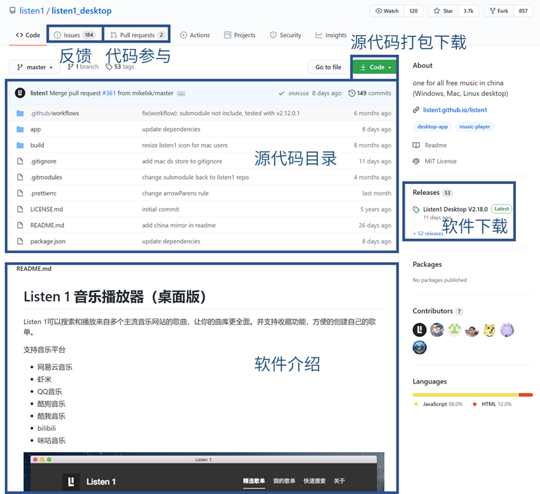
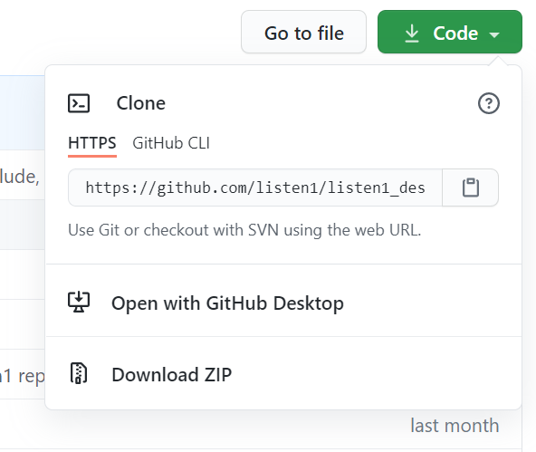
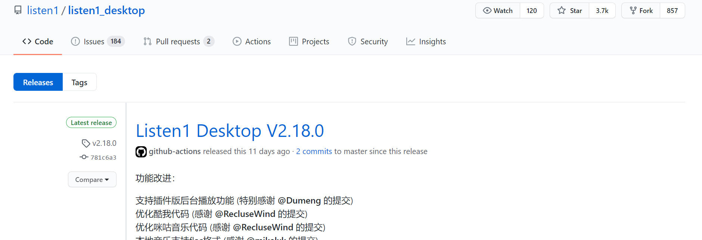
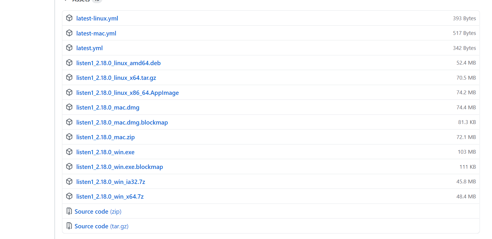
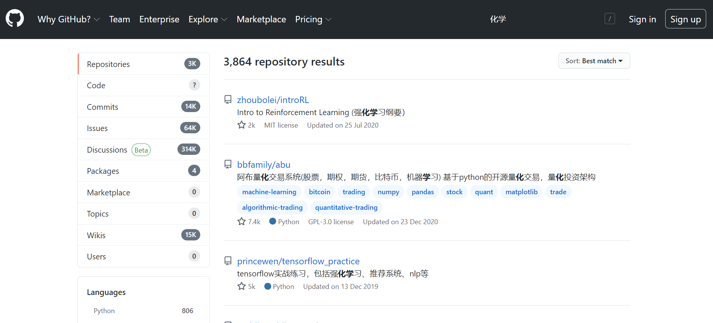
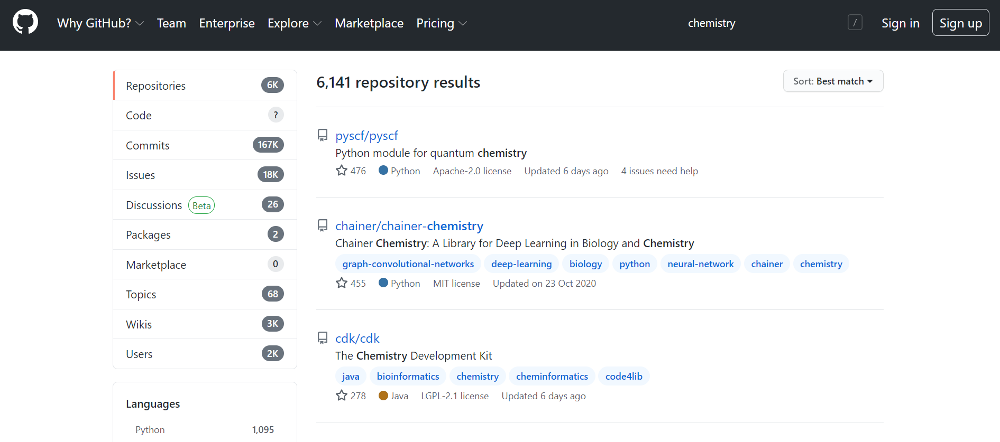

Github以仓库(repo)为基本单元组织内容。一个仓库相当于一个网盘，用户可以上传、下载、分享文件。

Github仓库提供强大的版本管理功能，允许多个用户协作编辑，尤其适合代码编辑。因此，Github成为了软件协作开发的平台
Github仓库还有以下功能：
1. Issue：相当于bbs+todo，用户可以反馈bug或提出功能需求，开发者通过Issue管理项目进度。
2. Pull Request：用户与软件开发者协作开发。
    为了防止恶意破坏，一般的Github仓库只有仓库主人才能权限修改，其他用户只能读取。其他用户可以先复制自己的账号下（fork），进行修改，再提交给仓库主人过目（Pull Request）。仓库主人同意后，该修改即合并入主仓库。
3. Release：软件发布。仓库用于存放源代码，而Release用于存放软件编译出来的exe/apk等目标文件。

## 仓库页面
Github仓库页面提供软件下载、源代码下载、向开发者反馈等功能。下面以[listen1_desktop](https://github.com/listen1/listen1_desktop)为例，介绍

打开[listen1_desktop仓库](https://github.com/listen1/listen1_desktop)

Issue：软件用户向开发者反馈Bug、提出需求等

Pull Request：与软件开发者协作开发（将在以后介绍）

如需打包下载源代码，点击绿色的“↓Code”按钮,并选择“Download Zip”

如需下载软件，点击右侧的Releases

向下滚动，找到Assets

找到与自己系统对应的安装包，点击即可下载。

## 搜索
与搜索引擎类似，直接在Github主页右上角的“search Github”中输入即可。

注意：Github搜索对中文的支持很差，例如搜索“化学”，会得到大量与“强化学习”相关的内容

改用英文搜索“chemistry”，即可得到正确结果

